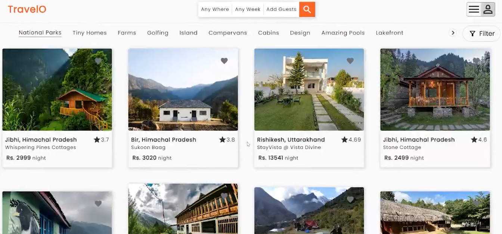

<p align="center">
    
</p>
<h1 align="center">
  WanderNest - Your Home Away From Home
</h1>

# WanderNest
A full-stack travel accommodation platform inspired by Airbnb, built with React and Express.js, enabling users to discover, book, and manage property stays with features like user authentication, property search, and secure payments.

## 🚀 Features
- **User Authentication**
  - Secure registration and login system
  - User profiles and booking history
  - Protected routes and user sessions
  
- **Property Management**
  - Dynamic property listings with detailed information
  - Property search and filtering
  - Real-time availability updates
  - Property image galleries
  
- **Booking System**
  - Seamless booking process
  - Secure payment integration
  - Booking confirmation and history
  - Date range selection

- **User Experience**
  - Responsive design for all devices
  - Interactive property maps
  - User reviews and ratings
  - Wishlist functionality

## 🛠️ Tech Stack
### Frontend
- React.js
- HTML5 & CSS3
- JavaScript (ES6+)
- React Router for navigation
- Responsive design principles
- Axios for API calls

### Backend
- Express.js
- MongoDB for database
- RESTful API architecture
- JWT authentication
- Payment gateway integration

## Installation
1. Clone the repository
```bash
git clone https://github.com/yourusername/wandernest.git
cd wandernest

2.Install backend dependencies
```bash
cd server
npm install

3. Install frontend dependencies
```bash
cd client
npm install

4. Start the development servers
```bash
# Terminal 1: Start backend server
cd server
npm run dev

# Terminal 2: Start frontend server
cd client
npm run dev

###🔒 Security Features

Password hashing with bcrypt
JWT-based authentication
HTTP-only cookies
Protected routes
CORS configuration
Input validation
Comprehensive error handling

###🧪 Running Tests

Register a new user
Login with credentials
Create and manage blog posts
Test star/unstar functionality
Verify post deletion
Check authentication persistence
Test protected routes
